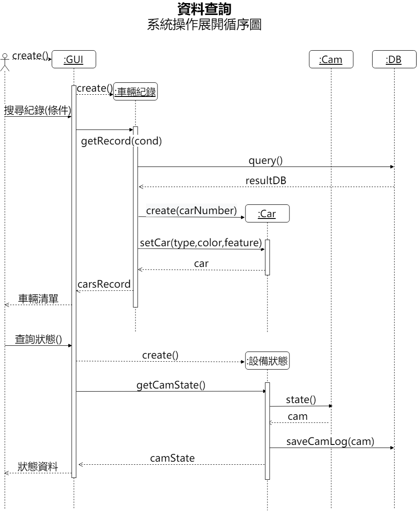
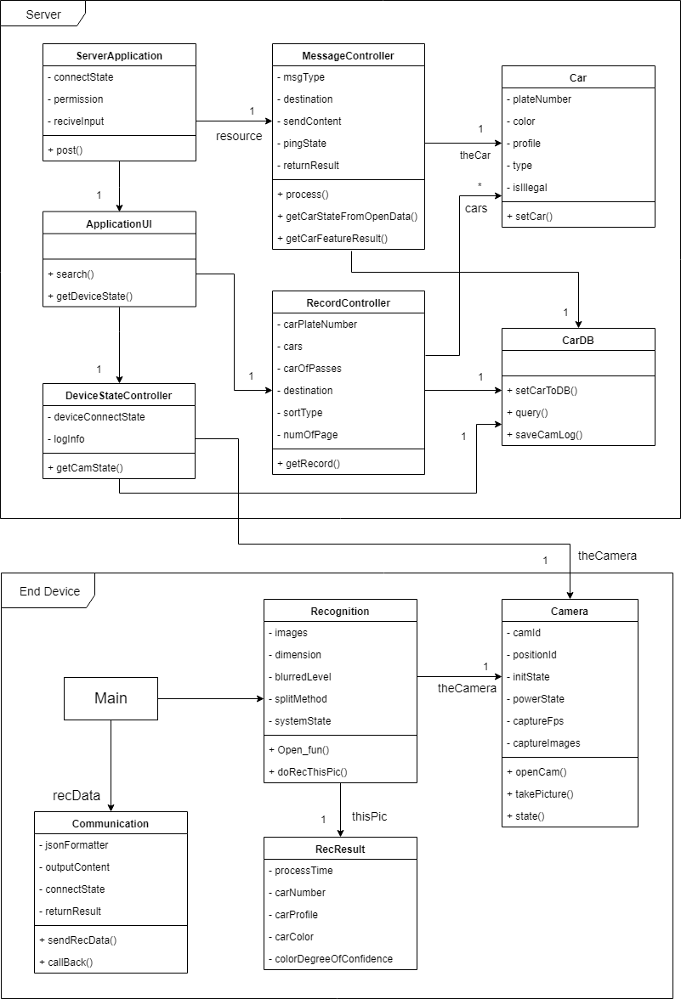

## **《 車輛身份辨識系統 》**

* Keyword : 車牌、贓車、即時辨識、監控


1. 專題需求 

	**簡介**

	一個小型邊緣運算的解決方案，可以在車流量大的路段架設本裝置，能即時的辨識車輛資訊，並能夠取得車輛特徵。現階段功能會透過車牌資料查詢內政部的開放資料(Open Data)來找出贓車或失竊車，應用影像辨識同時，另外取得輪廓、顏色、地點、通行次數及時間等數據，能於未來進行AI及大數據的資料分析。

	**背景**

	近期影像辨識技術盛行，有不少別出新意的應用，我們希望透過此案例- 尋找出贓車以及失竊車為目的來實作，嘗試分析學校附近是否存在不法車輛，作為一個有趣的小專題，希望本系統可以達到自動化、即時、省資源的目標。

	<table>
	  <tr>
	    <td>使用者需求(List)</td>
	  </tr>
	  <tr>
	    <td>
		    <ul>
			    <li>在校園中車流量大的路段設置攝影機</li>
	<li>能查詢經過的車輛是否為贓車或失竊車</li>
	<li>找到失竊車能即時告知車主</li>
	<li>攝影機必須能夠捕捉到清楚且精確的畫面</li>
	<li>影像辨識功能快速精準</li>
			    <li>可取得車子輪廓、顏色的資訊</li>
		    </ul>
		  </td>
	  </tr>
	</table>


2. 專題之功能性需求與非功能性需求 

	<table>
	  <tr>
	    <td>功能性需求</td>
	    <td>非功能性需求</td>
	  </tr>
	  <tr>
	    <td><p>終端裝置具即時的影像辨識功能</p>
	<p>查詢開放式資料，檢查車輛是否為贓車或失竊車</p>
	<p>找到失竊車會即時告知警方</p>
	<p提供數據的查詢介面</p></td>
	    <td>操作性:能鑲在現有的紅綠燈或路燈上設置攝影機

	效能:攝影機能夠捕捉到清楚且精確的畫面，高於10fps
	<p>系統耗電量低且不占用過多網路資源</p>

	安全:數據資料僅供學術使用
	<p>終端處理裝置只傳出不傳入</p>

	文化與政策性:系統應符合法規蒐集資料</td>
	  </tr>
	</table>


3. 使用案例圖 (Use case diagram)

    

4. 列出使用案例及使用案例的重要性

	<table>
	  <tr>
	    <td>使用案例</td>
	    <td><p>終端裝置(Nvidia Jet nano):
	辨識車牌(預處理,分割,OCR)-傳送車輛特徵</p>
	<p>伺服器裝置: 
	檢查車輛資訊-蒐集資訊-訊息推播</p>
	<p>使用者:
	 查詢紀錄-裝置狀態監看</p></td>
	  </tr>
	  <tr>
	    <td>使用案例的重要性</td>
	    <td><p>捕捉系統的需求、塑模系統的功能及用途</p>
	<p>在情境中描述系統所應具有的行為</p>
	<p>從需求分析文件中找出與系統互動的角色、每個角色與使用案例的關聯性，以及使用案例之間的相互關係</p></td>
	  </tr>
	</table>

5. 寫出 其中的 至少三個使用案例

a.辨識車牌

   主要成功情節

	a-a 啟動攝影系統
	a-b 捕捉車輛影像，擷取車牌圖片
	a-c 圖片預處理
	a-d 辨識車牌號碼、取得特徵
   例外情節

	*a-a如果攝影系統啟動失敗，若重啟3次都失敗，則通知管理者
	*a-d若照片不清晰，或是其他因素導致辨識失敗，則丟棄照片。

b.傳送車輛特徵

   主要成功情節
   
	b-a 整理特徵資料
	b-b 將車牌、時間、輪廓、顏色與地點編號整理成JSON格式
	b-c 透過wifi或是4G網路將資訊傳送到伺服器API
   例外情節

	b-c-a 如果傳送失敗(即沒有收到ACK)就把資料先儲存在資料庫中，並檢查為本地端的問題，還是API的問題。
	b-c-b若為本地端問題則通知管理者。
	b-c-c若為API的問題則擱置資料。
	b-c-d 每12小時檢查是否存在未傳送的資料，並重複b-c的工作
	b-c-e若超過24小時無法傳送資料，就通知管理者

c.檢查車輛資訊

   主要成功情節:

	c-a 將JSON格式拆解，得到車牌號碼、車輛特徵、時間與地點編號
	c-b 車號傳送至開放平台檢查車輛資訊(型態為:失竊、贓車、合法、NULL)
	c-c 若平台傳回資訊成功，則儲存車輛狀態
	c-d 發現是失竊或贓車就馬上通知給執法單位

   例外情節:
   
	c-c-a若資料傳送失敗，則將車輛資訊設為NULL，照常存入資料庫
	c-c-b檢查內政部的連線，若正常再傳送一次資料以驗證車輛資訊，
	(若成功更新該車輛的車輛資訊，若這次仍然傳送失敗則一樣維持NULL，重複c-c-a到c-c-b)
	c-c-c如果檢查內政部的連線，不正常則擱置資料3小時後，重複c-c-b。
	c-d-a若一筆資料檢查3次以後，仍然車輛資訊仍然是NULL，就通知管理者進行處理。
	c-b-c，重新回傳

6. 寫出 Users story

* 身為一個 **學生** 我希望能有 **一個動態搜尋車輛車牌及收集車輛特徵**的系統 以**收集可以協助行銷及抑制犯罪所需要的資料**

* 身為一個 **影像辨識系統**  我希望能有 **協調好攝影機跟影像辨識演算法**並在不耗費過多資源的前提下 能**正確回傳辨識結果給分析端**

* 身為一個 **分析系統**  我希望能有 **可解析的資料並辨識車輛資訊以整合至資料庫儲存**，必要時會通知執法單位。


7. 初步類別圖 (Initial class diagram)

    

8. 系統操作循序圖 (System Operation Sequence diagram)

    
    
9. 強韌圖 (Robustness diagram)

    

10. 循序圖 (Sequence diagram)

    
     
      

10. 類別圖 (Class diagram)
	

***

# Name: CHEN,YOU-SHENG

## StudentID: 0624011

### Department: Information management

#### Our major project: AI, IOT, Website

##### Our team members: 
* 0624011 陳佑昇
* 0624091 林致嘉
* 0624103 陳建銘
* 1061231133 洪然峰

###### `This is my first assignment. 😀`

```
    Hello, my name is YOU SHENG, CHEN. You can call me “Shane” and it represents
a shining and outstanding person. This name is from my English teacher’s expectations to
me and I like it so much. In fact, I am curious about many things and have good
observation ability.

    My interests are cycling and jogging. Especially enjoy the moment of riding the
bicycle with my friends. In addition, we sometimes challenge goals, maybe a mountain or
cycling for a far distance and have memorable memories.
I’m good at computer-related ability, such as computer programming, computer
assembling, repair computer and more, and welcome to ask me questions! I’m glad to
solve 3C problems for others.

    I study at Taiwan National Kaohsiung University of Science and Technology, First
Campus, learning about information management skills. The school education resources
are rich, it provides multicultural teaching and a comfortable environment for learning. I
have been a cooperative and obedient student in my teacher's eyes, and I think it’s my
concern for others that makes me popular.

    In the near future, I hope I have an opportunity to develop my interest and abilities
here. I believe I can bring my professional field into my career.
```
[NKUST offical website](www.nkust.edu.tw)
<www.nkust.edu.tw>


| Left | Center | Right |
|:-----|:------:|------:|
|Hey   |guy     |^^     |
|I'm   |here    |:wave: |

:cherry_blossom: :tulip: :four_leaf_clover:
:rose: :sunflower: :hibiscus:
:maple_leaf: :leaves: :fallen_leaf:
:herb: :mushroom: :cactus:
:palm_tree:	:evergreen_tree: :deciduous_tree:
:ear_of_rice: :seedling: :blossom:


[](https://www.youtube.com/watch?v=StTqXEQ2l-Y "Everything Is AWESOME")


> Quicksort in Java
``` java
static int partition(int[] array, int begin, int end) {
    int pivot = end;

    int counter = begin;
    for (int i = begin; i < end; i++) {
        if (array[i] < array[pivot]) {
            int temp = array[counter];
            array[counter] = array[i];
            array[i] = temp;
            counter++;
        }
    }
    int temp = array[pivot];
    array[pivot] = array[counter];
    array[counter] = temp;

    return counter;
}

public static void quickSort(int[] array, int begin, int end) {
    if (end <= begin) return;
    int pivot = partition(array, begin, end);
    quickSort(array, begin, pivot-1);
    quickSort(array, pivot+1, end);
}
```

