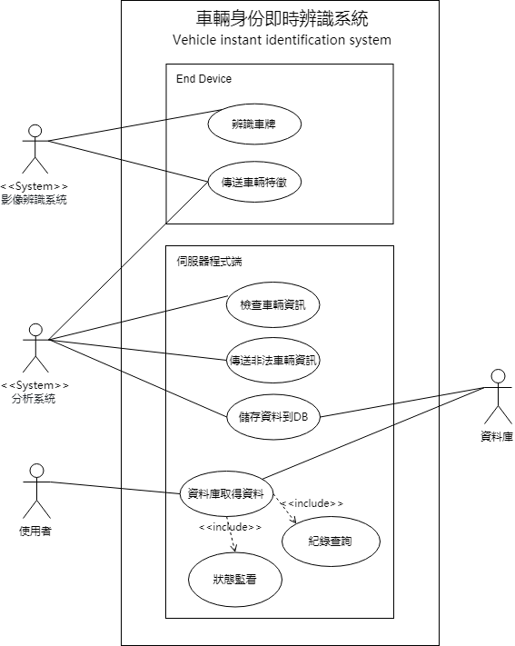
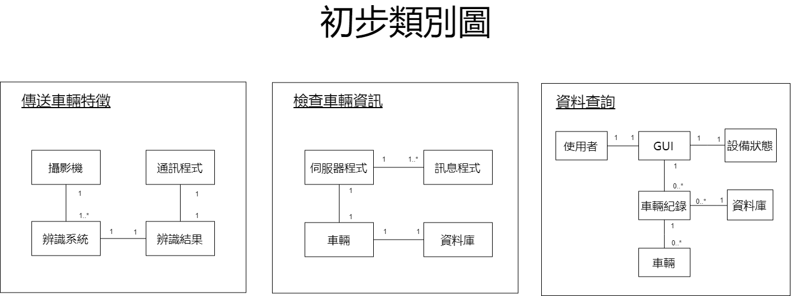
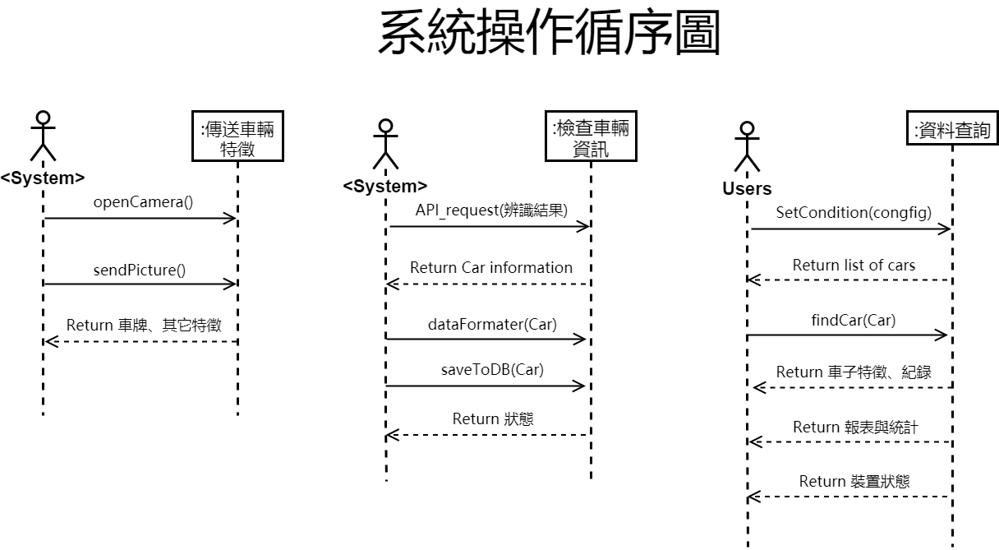
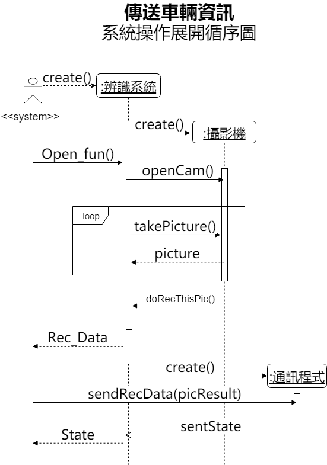

## **《 車輛身份辨識系統 》**

* Keyword : 車牌、贓車、即時辨識、監控


1. 專題需求 

	**簡介**

	一個小型邊緣運算的解決方案，可以在車流量大的路段架設本裝置，能即時的辨識車牌資訊，並查詢內政部的開放資料(Open Data)來分別找出贓車或失竊車。

	**背景**

	近期影像辨識技術盛行，有不少別出新意的應用，我們希望透過此案例- 尋找贓車及失竊車來實作，嘗試分析學校附近是否存在不法車輛，作為一個有趣的小研究，希望本系統能達到自動化、即時、省資源的目標。

	<table>
	  <tr>
	    <td>使用者需求(List)</td>
	  </tr>
	  <tr>
	    <td>
		    <ul>
			    <li>在校園中車流量大的路段設置攝影機</li>
	<li>能查詢經過的車輛是否為贓車或失竊車</li>
	<li>找到失竊車能即時告知車主</li>
	<li>攝影機必須能夠捕捉到清楚且精確的畫面</li>
	<li>影像辨識功能快速精準</li>
		    </ul>
		  </td>
	  </tr>
	</table>


2. 專題之功能性需求與非功能性需求 

	<table>
	  <tr>
	    <td>功能性需求</td>
	    <td>非功能性需求</td>
	  </tr>
	  <tr>
	    <td><p>終端裝置具即時的影像辨識功能</p>
	<p>查詢開放式資料，檢查車輛是否為贓車或失竊車</p>
	<p>找到失竊車會即時告知警方</p>
	<p>晚上能開啟夜間模式，不被光線影響</p></td>
	    <td>操作性:能鑲在現有的紅綠燈或路燈上設置攝影機

	效能:攝影機能夠捕捉到清楚且精確的畫面，高於10fps
	<p>系統耗電量低且不占用過多網路資源</p>

	安全:資料數據由地方警察局保存
	<p>終端處理裝置只傳出不傳入</p>

	文化與政策性:系統應符合法規蒐集資料</td>
	  </tr>
	</table>


3. 使用案例圖 (Use case diagram)

    

4. 列出使用案例及使用案例的重要性

	<table>
	  <tr>
	    <td>使用案例</td>
	    <td><p>終端裝置(Nvidia Jet nano):
	辨識車牌(預處理,分割,OCR)-傳送車輛特徵</p>
	<p>伺服器裝置: 
	檢查車輛資訊-蒐集資訊-訊息推播</p>
	<p>使用者(執法單位、研究師生):
	 查詢紀錄-裝置狀態監看</p></td>
	  </tr>
	  <tr>
	    <td>使用案例的重要性</td>
	    <td><p>捕捉系統的需求、塑模系統的功能及用途</p>
	<p>在情境中描述系統所應具有的行為</p>
	<p>從需求分析文件中找出與系統互動的角色、每個角色與使用案例的關聯性，以及使用案例之間的相互關係</p></td>
	  </tr>
	</table>

5. 寫出 其中的 至少三個使用案例

a.辨識車牌

	a-a 啟動攝影系統

	a-b 捕捉車輛影像，擷取車牌圖片

	a-c 圖片預處理

	a-d 辨識車牌號碼、取得特徵

b.傳送車輛特徵

	b-a 整理特徵資料
	
	b-b 將車牌、時間、輪廓、顏色與地點編號整理成JSON格式

	b-c 透過wifi或是4G網路將資訊傳送到伺服器API

	b-d 傳送失敗(即沒有收到ACK)就把資料先儲存在檔案中

	b-e 每半天檢查是否存在未傳送的資料(重新送出)

c.檢查車輛資訊

	c-a 將JSON格式拆解，得到車牌號碼、時間與地點編號

	c-b 車號傳送至開放平台檢查車輛資訊

	c-c 若平台傳回非犯罪車輛則丟棄車牌資料，若是則儲存車牌

	c-d 發現是失竊或贓車就馬上通知給執法單位


6. 寫出 Users story

* 身為一個 **研究學生** 我希望能有 **一個動態搜尋車輛車牌**的系統 以**避免有危險車輛進入校園，造成師生生命安全威脅**

* 身為一個 **執法單位**  我希望能有 **一個簡單便利的系統**並在不耗費過多資源的前提下 能**即時找回失竊車輛並抑制車輛犯罪**


7. 初步類別圖 (Initial class diagram)

    

8. 系統操作循序圖 (System Operation Sequence diagram)

    
    
9. 強韌圖 (Robustness diagram)

    

10. 展開操作循序圖 (Operation Sequence diagram)

    
     
      


***

# Name: CHEN,YOU-SHENG

## StudentID: 0624011

### Department: Information management

#### Our major project: AI, IOT, Website

##### Our team members: 
* 0624011 陳佑昇
* 0624091 林致嘉
* 0624103 陳建銘
* 1061231133 洪然峰

###### `This is my first assignment. 😀`

```
    Hello, my name is YOU SHENG, CHEN. You can call me “Shane” and it represents
a shining and outstanding person. This name is from my English teacher’s expectations to
me and I like it so much. In fact, I am curious about many things and have good
observation ability.

    My interests are cycling and jogging. Especially enjoy the moment of riding the
bicycle with my friends. In addition, we sometimes challenge goals, maybe a mountain or
cycling for a far distance and have memorable memories.
I’m good at computer-related ability, such as computer programming, computer
assembling, repair computer and more, and welcome to ask me questions! I’m glad to
solve 3C problems for others.

    I study at Taiwan National Kaohsiung University of Science and Technology, First
Campus, learning about information management skills. The school education resources
are rich, it provides multicultural teaching and a comfortable environment for learning. I
have been a cooperative and obedient student in my teacher's eyes, and I think it’s my
concern for others that makes me popular.

    In the near future, I hope I have an opportunity to develop my interest and abilities
here. I believe I can bring my professional field into my career.
```
[NKUST offical website](www.nkust.edu.tw)
<www.nkust.edu.tw>


| Left | Center | Right |
|:-----|:------:|------:|
|Hey   |guy     |^^     |
|I'm   |here    |:wave: |

:cherry_blossom: :tulip: :four_leaf_clover:
:rose: :sunflower: :hibiscus:
:maple_leaf: :leaves: :fallen_leaf:
:herb: :mushroom: :cactus:
:palm_tree:	:evergreen_tree: :deciduous_tree:
:ear_of_rice: :seedling: :blossom:


[](https://www.youtube.com/watch?v=StTqXEQ2l-Y "Everything Is AWESOME")


> Quicksort in Java
``` java
static int partition(int[] array, int begin, int end) {
    int pivot = end;

    int counter = begin;
    for (int i = begin; i < end; i++) {
        if (array[i] < array[pivot]) {
            int temp = array[counter];
            array[counter] = array[i];
            array[i] = temp;
            counter++;
        }
    }
    int temp = array[pivot];
    array[pivot] = array[counter];
    array[counter] = temp;

    return counter;
}

public static void quickSort(int[] array, int begin, int end) {
    if (end <= begin) return;
    int pivot = partition(array, begin, end);
    quickSort(array, begin, pivot-1);
    quickSort(array, pivot+1, end);
}
```

